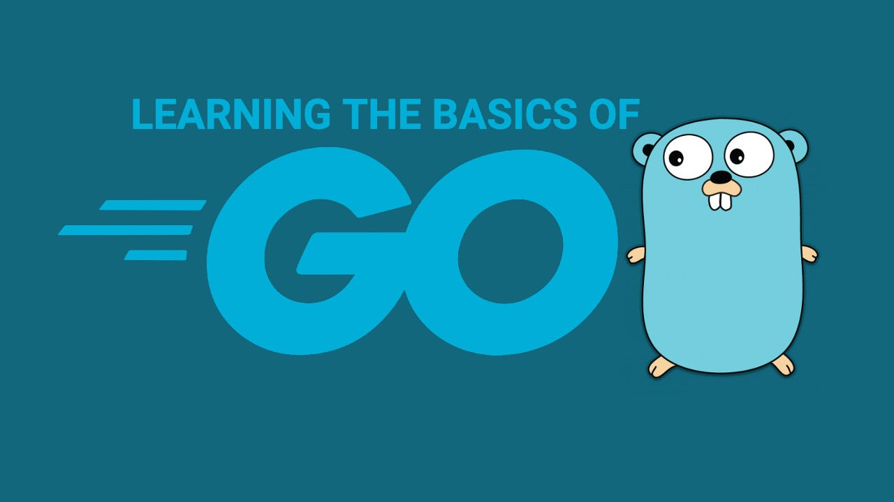

# Basic Go Card Game

This served as an introduction to Go for me. 

## Functions

### CreateDeck()

Creates a deck of cards. Uses two `for` loops to iterate through the `suits` and `values` slices. Returns a `deck` type of `[]string` containing all 52 cards.

### Print()

Prints the deck of cards and their index. Uses a `for` loop to iterate through the `deck` and print each card.

### Deal()

Deals a hand of cards. Takes in a `deck` and a `handSize` of type `int`. Returns a `deck` of type `[]string` containing the hand of cards and a `deck` of type `[]string` containing the remaining cards.

### toString()

Converts a `deck` of type `[]string` to a `string` of type `string`. Uses the `strings` package to join the `deck` with a comma.

### saveToFile()

Saves a `deck` to a file and creates the file if it doesn't exist. 

Uses the `os` package and `WriteFile` function to write the `deck` to a file as a `[]byte`.

### newDeckFromFile()

Reads a file of type `[]byte` and converts it into a `deck`. 

Uses the `os` package and `ReadFile` function, `strings` package and `Split` function to read the file and convert it into a `deck`.

### shuffle()

Creating a random number generator was done by using the `rand` package and creating a `Source` using the `time` package. This ensured that a new seed was used each time the program was run.

The `shuffle` function uses a `for` loop to iterate through the `deck` and swap the current card with a random card.

## Testing

Testing was done using the `testing` package.

Created tests for the `newDeck`, `saveToFile`, `newDeckFromFile` and `shuffle` function.

